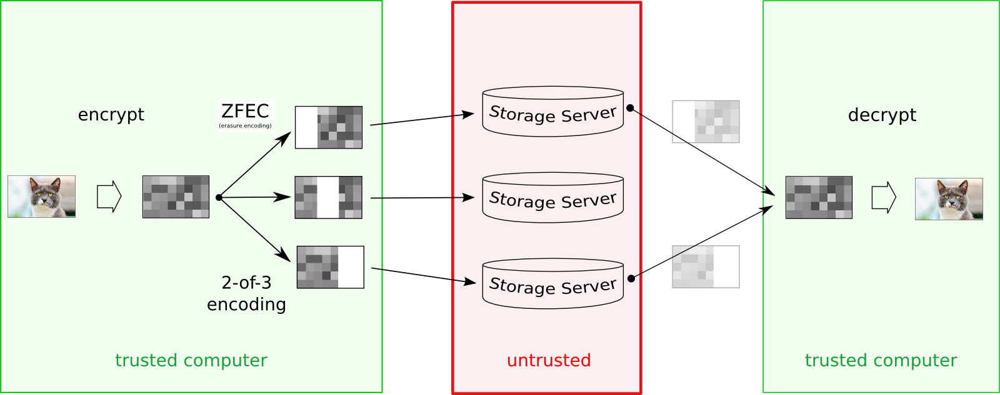

======================================
Free and Open Decentralized Data Store
======================================

|image0|

`Tahoe-LAFS <https://www.tahoe-lafs.org>`__ (Tahoe Least-Authority File Store) is the first free software / open-source storage technology that distributes your data across multiple servers. Even if some servers fail or are taken over by an attacker, the entire file store continues to function correctly, preserving your privacy and security.

|Contributor Covenant|  |readthedocs|  |circleci|  |githubactions|  |coveralls|

Table of contents

-  `About Tahoe-LAFS <#about-tahoe-lafs>`__

-  `Installation <#installation>`__

-  `Issues <#issues>`__

-  `Documentation <#documentation>`__

-  `Community <#community>`__

-  `Contributing <#contributing>`__

-  `FAQ <#faq>`__

-  `License <#license>`__

💡 About Tahoe-LAFS
-------------------

Tahoe-LAFS helps you to store files while granting confidentiality, integrity, and availability of your data.

How does it work? You run a client program on your computer, which talks to one or more storage servers on other computers. When you tell your client to store a file, it will encrypt that file, encode it into multiple pieces, then spread those pieces out among various servers. The pieces are all encrypted and protected against modifications. Later, when you ask your client to retrieve the file, it will find the necessary pieces, make sure they haven’t been corrupted, reassemble them, and decrypt the result.

| |image2|
| *The image is taken from meejah's* \  `blog <https://blog.torproject.org/tor-heart-tahoe-lafs>`__ \  *post at Torproject.org.*

|

The client creates pieces (“shares”) that have a configurable amount of redundancy, so even if some servers fail, you can still get your data back. Corrupt shares are detected and ignored so that the system can tolerate server-side hard-drive errors. All files are encrypted (with a unique key) before uploading, so even a malicious server operator cannot read your data. The only thing you ask of the servers is that they can (usually) provide the shares when you ask for them: you aren’t relying upon them for confidentiality, integrity, or absolute availability.

Tahoe-LAFS was first designed in 2007, following the "principle of least authority", a security best practice requiring system components to only have the privilege necessary to complete their intended function and not more.

Please read more about Tahoe-LAFS architecture `here <docs/architecture.rst>`__.

✅ Installation
---------------

For more detailed instructions, read `Installing Tahoe-LAFS <docs/Installation/install-tahoe.rst>`__.

Once ``tahoe --version`` works, see `How to Run Tahoe-LAFS <docs/running.rst>`__ to learn how to set up your first Tahoe-LAFS node.

🐍 Python 2
-----------

Python 3.9 or later is required.
If you are still using Python 2.7, use Tahoe-LAFS version 1.17.1.

🤖 Issues
---------

Tahoe-LAFS uses the Trac instance to track `issues <https://www.tahoe-lafs.org/trac/tahoe-lafs/wiki/ViewTickets>`__. Please email jean-paul plus tahoe-lafs at leastauthority dot com for an account.

📑 Documentation
----------------

You can find the full Tahoe-LAFS documentation at our `documentation site <http://tahoe-lafs.readthedocs.io/en/latest/>`__.

💬 Community
------------

Get involved with the Tahoe-LAFS community:

-  Chat with Tahoe-LAFS developers at ``#tahoe-lafs`` channel on `libera.chat <https://libera.chat/>`__ IRC network or `Slack <https://join.slack.com/t/tahoe-lafs/shared_invite/zt-jqfj12r5-ZZ5z3RvHnubKVADpP~JINQ>`__.

-  Join our `weekly conference calls <https://www.tahoe-lafs.org/trac/tahoe-lafs/wiki/WeeklyMeeting>`__ with core developers and interested community members.

-  Subscribe to `the tahoe-dev mailing list <https://lists.tahoe-lafs.org/mailman/listinfo/tahoe-dev>`__, the community forum for discussion of Tahoe-LAFS design, implementation, and usage.

🤗 Contributing
---------------

As a community-driven open source project, Tahoe-LAFS welcomes contributions of any form:

-  `Code patches <https://tahoe-lafs.org/trac/tahoe-lafs/wiki/Patches>`__

-  `Documentation improvements <https://tahoe-lafs.org/trac/tahoe-lafs/wiki/Doc>`__

-  `Bug reports <https://tahoe-lafs.org/trac/tahoe-lafs/wiki/HowToReportABug>`__

-  `Patch reviews <https://tahoe-lafs.org/trac/tahoe-lafs/wiki/PatchReviewProcess>`__

Before authoring or reviewing a patch, please familiarize yourself with the `Coding Standard <https://tahoe-lafs.org/trac/tahoe-lafs/wiki/CodingStandards>`__ and the `Contributor Code of Conduct <docs/CODE_OF_CONDUCT.md>`__. 

🥳 First Contribution?
----------------------

If you are committing to Tahoe for the very first time, it's required that you add your name to our contributor list in `CREDITS <CREDITS>`__. Please ensure that this addition has it's own commit within your first contribution.

🤝 Supporters
--------------

We would like to thank `Fosshost <https://fosshost.org>`__ for supporting us with hosting services. If your open source project needs help, you can apply for their support.

We are grateful to `Oregon State University Open Source Lab <https://osuosl.org/>`__ for hosting tahoe-dev mailing list.

❓ FAQ
------

Need more information? Please check our `FAQ page <https://www.tahoe-lafs.org/trac/tahoe-lafs/wiki/FAQ>`__.

📄 License
----------

Copyright 2006-2020 The Tahoe-LAFS Software Foundation

You may use this package under the GNU General Public License, version 2 or, at your option, any later version. You may use this package under the Transitive Grace Period Public Licence, version 1.0, or at your choice, any later version. (You may choose to use this package under the terms of either license, at your option.) See the file `COPYING.GPL <COPYING.GPL>`__ for the terms of the GNU General Public License, version 2. See the file `COPYING.TGPPL <COPYING.TGPPL.rst>`__ for the terms of the Transitive Grace Period Public Licence, version 1.0.

See `TGPPL.PDF <https://tahoe-lafs.org/~zooko/tgppl.pdf>`__ for why the TGPPL exists, graphically illustrated on three slides.

.. |image0| image:: docs/_static/media/image2.png
   :width: 3in
   :height: 0.91667in

.. |readthedocs| image:: http://readthedocs.org/projects/tahoe-lafs/badge/?version=latest
    :alt: documentation status
    :target: http://tahoe-lafs.readthedocs.io/en/latest/?badge=latest

.. |circleci| image:: https://circleci.com/gh/tahoe-lafs/tahoe-lafs.svg?style=svg
    :target: https://circleci.com/gh/tahoe-lafs/tahoe-lafs

.. |githubactions| image:: https://github.com/tahoe-lafs/tahoe-lafs/actions/workflows/ci.yml/badge.svg
    :target: https://github.com/tahoe-lafs/tahoe-lafs/actions

.. |coveralls| image:: https://coveralls.io/repos/github/tahoe-lafs/tahoe-lafs/badge.svg
    :alt: code coverage
    :target: https://coveralls.io/github/tahoe-lafs/tahoe-lafs

.. |Contributor Covenant| image:: https://img.shields.io/badge/Contributor%20Covenant-v2.0%20adopted-ff69b4.svg
    :alt: code of conduct
    :target: docs/CODE_OF_CONDUCT.md
