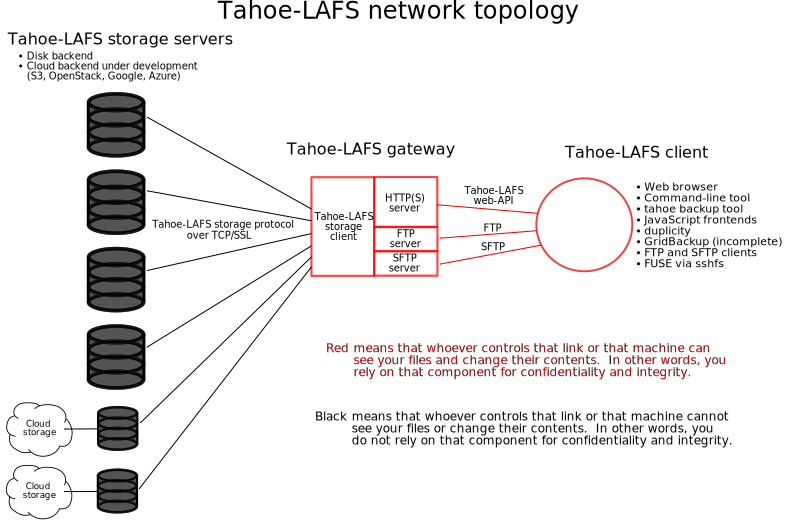

.. -*- coding: utf-8-with-signature -*-

Welcome to Tahoe-LAFS!
======================

Welcome to Tahoe-LAFS_, the first decentralized storage system with
*provider-independent security*.

.. _Tahoe-LAFS: https://tahoe-lafs.org

What is "provider-independent security"?
========================================

Every seller of cloud storage services will tell you that their service is
"secure".  But what they mean by that is something fundamentally different
from what we mean.  What they mean by "secure" is that after you've given
them the power to read and modify your data, they try really hard not to let
this power be abused.  This turns out to be difficult!  Bugs,
misconfigurations, or operator error can accidentally expose your data to
another customer or to the public, or can corrupt your data.  Criminals
routinely gain illicit access to corporate servers.  Even more insidious is
the fact that the employees themselves sometimes violate customer privacy out
of carelessness, avarice, or mere curiosity.  The most conscientious of
these service providers spend considerable effort and expense trying to
mitigate these risks.

What we mean by "security" is something different.  *The service provider
never has the ability to read or modify your data in the first place: never.*
If you use Tahoe-LAFS, then all of the threats described above are non-issues
to you.  Not only is it easy and inexpensive for the service provider to
maintain the security of your data, but in fact they couldn't violate its
security if they tried.  This is what we call *provider-independent
security*.

This guarantee is integrated naturally into the Tahoe-LAFS storage system and
doesn't require you to perform a manual pre-encryption step or cumbersome key
management.  (After all, having to do cumbersome manual operations when
storing or accessing your data would nullify one of the primary benefits of
using cloud storage in the first place: convenience.)

Here's how it works:

A "storage grid" is made up of a number of storage servers.  A storage server
has direct attached storage (typically one or more hard disks).  A "gateway"
communicates with storage nodes, and uses them to provide access to the
filesystem over protocols such as HTTP(S), SFTP or FTP.

Note that you can find "client" used to refer to gateway nodes (which act as
a client to storage servers), and also to processes or programs connecting to
a gateway node and performing operations on the grid -- for example, a CLI
command, Web browser, SFTP client, or FTP client.

Users do not rely on storage servers to provide *confidentiality* nor
*integrity* for their data -- instead all of the data is encrypted and
integrity-checked by the gateway, so that the servers can neither read nor
modify the contents of the files.

Users do rely on storage servers for *availability*.  The ciphertext is
erasure-coded into ``N`` shares distributed across at least ``H`` distinct
storage servers (the default value for ``N`` is 10 and for ``H`` is 7) so
that it can be recovered from any ``K`` of these servers (the default
value of ``K`` is 3).  Therefore only the failure of ``H-K+1`` (with the
defaults, 5) servers can make the data unavailable.

In the typical deployment mode each user runs her own gateway on her own
machine.  This way she relies on her own machine for the confidentiality and
integrity of the data.

An alternate deployment mode is that the gateway runs on a remote machine and
the user connects to it over HTTPS or SFTP.  This means that the operator of
the gateway can view and modify the user's data (the user *relies on* the
gateway for confidentiality and integrity), but the advantage is that the
user can access the filesystem with a client that doesn't have the gateway
software installed, such as an Internet kiosk or cell phone.

Access Control
==============

There are two kinds of files: immutable and mutable. When you upload a file
to the storage grid you can choose which kind of file it will be in the
grid. Immutable files can't be modified once they have been uploaded.  A
mutable file can be modified by someone with read-write access to it. A user
can have read-write access to a mutable file or read-only access to it, or no
access to it at all.

A user who has read-write access to a mutable file or directory can give
another user read-write access to that file or directory, or they can give
read-only access to that file or directory.  A user who has read-only access
to a file or directory can give another user read-only access to it.

When linking a file or directory into a parent directory, you can use a
read-write link or a read-only link.  If you use a read-write link, then
anyone who has read-write access to the parent directory can gain read-write
access to the child, and anyone who has read-only access to the parent
directory can gain read-only access to the child.  If you use a read-only
link, then anyone who has either read-write or read-only access to the parent
directory can gain read-only access to the child.

For more technical detail, please see the `the doc page`_ on the Wiki.

.. _the doc page: https://tahoe-lafs.org/trac/tahoe-lafs/wiki/Doc

Get Started
===========

To use Tahoe-LAFS, please see quickstart.rst_.

.. _quickstart.rst: quickstart.rst

License
=======

Tahoe-LAFS is an open-source project; please see README.txt_ for details.

.. _README.txt: ../README.txt
